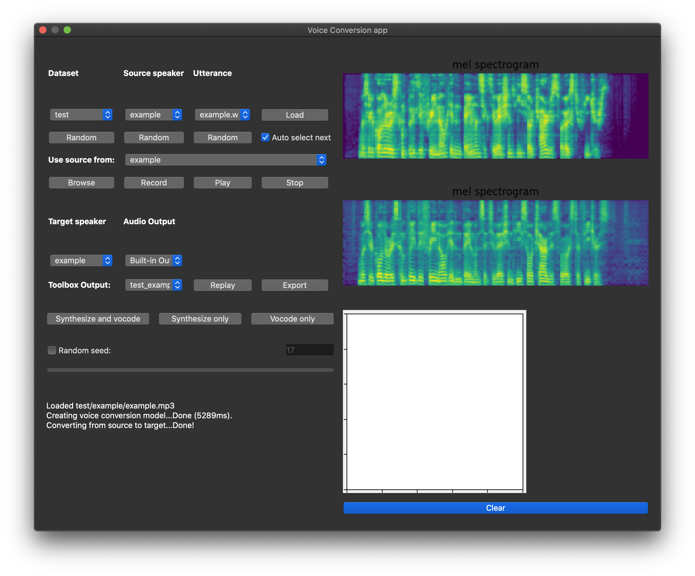

# Real-Time Voice Conversion



This repository implements a simple toolbox for voice conversion. It uses one of the latest result for mel-based source to target one-shot voice conversion model and fast GAN-based vocoder.

## Installation 

Application file of every release was created by [PyInstaller](https://pypi.org/project/pyinstaller/) making it available to build on many popular platforms (Windows, Mac OS X, GNU/Linux, etc). Download release archive for your OS, then simply start the application file named `VCToolbox` from unarchived zip.

Available OS releases:

- MacOS (For now (1.05) release isn't done)

## Installation (Development build)

1. Install Requirements (Python 3.7+ were tested ok)

```bash
pip install -r requirements.txt
```

**Note:** for mp3 support you should have ffmpeg installed (you can via `brew` for MacOS, `apt-get` for linux, static builds for windows).

2. Everything is complete for launching the toolbox. Required models will be loaded on first application run. Run toolbox with following command:

```bash
python3 app.py
```

3^{*}. You may want to run tests for this repo. It can be done via:

```
pytest
```

**Note:** that will also download models if they weren't.

## Credits

Author thanks developer of [CorentinJ/Real-Time-Voice-Cloning](github.com/CorentinJ/Real-Time-Voice-Cloning) for cool design and implementation ideas.